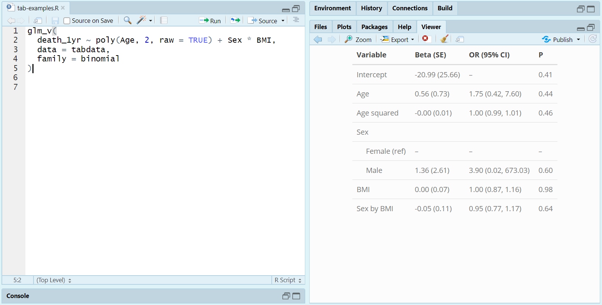
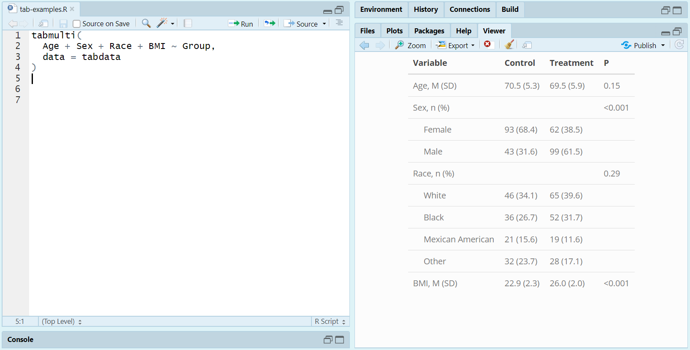

```{r setup, include = FALSE}
knitr::opts_chunk$set(
  collapse = TRUE,
  comment = "#>", 
  message = FALSE, 
  fig.width = 3
)

# Load packages
library("tab")
library("knitr")
library("gee")

# Set xtable options
options("xtable.caption.placement" = "top", 
        "xtable.include.rownames" = TRUE, 
        "xtable.comment" = FALSE)
```


## Installation

You can install and load **tab** from GitHub via the following code:

```{r, eval = FALSE}
devtools::install_github("vandomed/tab")
library("tab")
```

## Functions

The main purpose of **tab** is to create neatly formatted summary tables for papers and presentations. The following functions are included:

* `glm_v` prints a GLM summary table to the RStudio Viewer
* `tabglm` summarizes generalized linear models (GLM's) fit via `glm` or `survey::svyglm`
* `tabgee` summarizes generalized estimating equation models (GEE's) fit via `gee::gee`
* `tabcoxph` summarizes Cox Proportional Hazards models fit via `survival::coxph` or `survey::svycoxph`
* `tabmulti` compares variables across two or more groups, e.g. to create a "Table 1"
* `tabmulti.svy` does the same thing as `tabmulti` but for complex survey data


## Regression summaries with just 2 extra keystrokes

To summarize a fitted generalized linear model, simply call `glm_v` as you would `glm`. The result will be a formatted summary table printed to the RStudio Viewer. Here's an example for logistic regression:

```{r eval = FALSE}
glm_v(
  death_1yr ~ poly(Age, 2, raw = TRUE) + Sex * BMI, 
  data = tabdata, 
  family = binomial
)
```

```{r out.width = "100%", echo = FALSE}

```

From here, you can "snip" the summary table and save it as a figure (as I did for this README) or copy directly from the Viewer and paste outside of R. 

For more flexibility, see `tabglm`. That function lets you control things like what columns to present, how categorical predictors are presented, and so on.


## Summary tables for continuous and categorical variables

You can use `tabmulti` to summarize variables across two or more groups, using a formula interface. Here's an example:

```{r eval = FALSE}
tabmulti(Age + Sex + Race + BMI ~ Group, data = tabdata)
```

```{r out.width = "100%", echo = FALSE}

```


## Compatibility with Markdown/Knitr

The functions all return `kable` objects, so they should work perfectly well in R Markdown and knitr documents. 


## References
